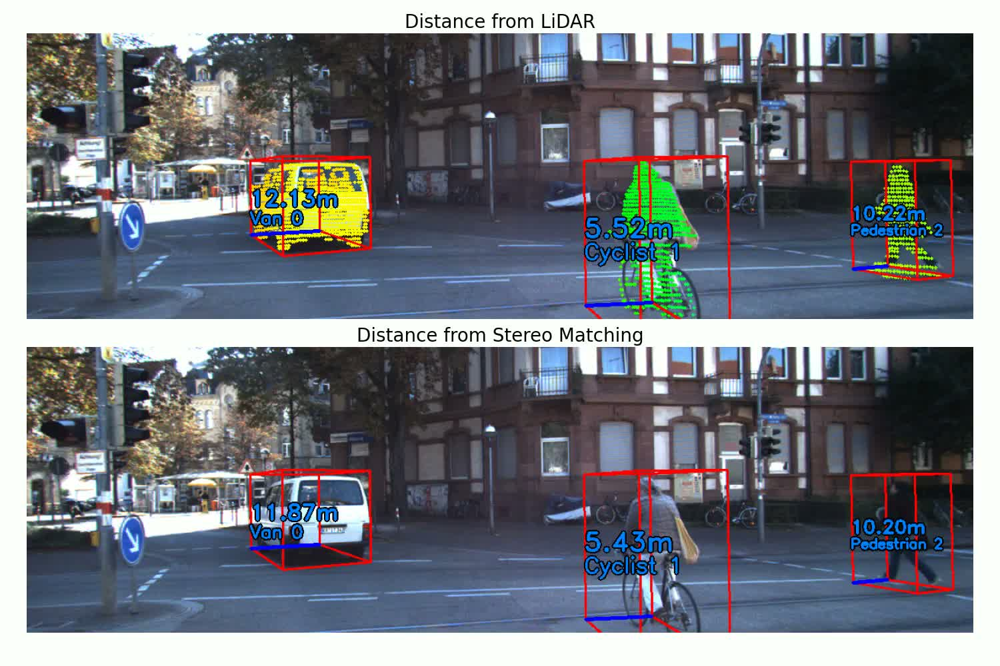
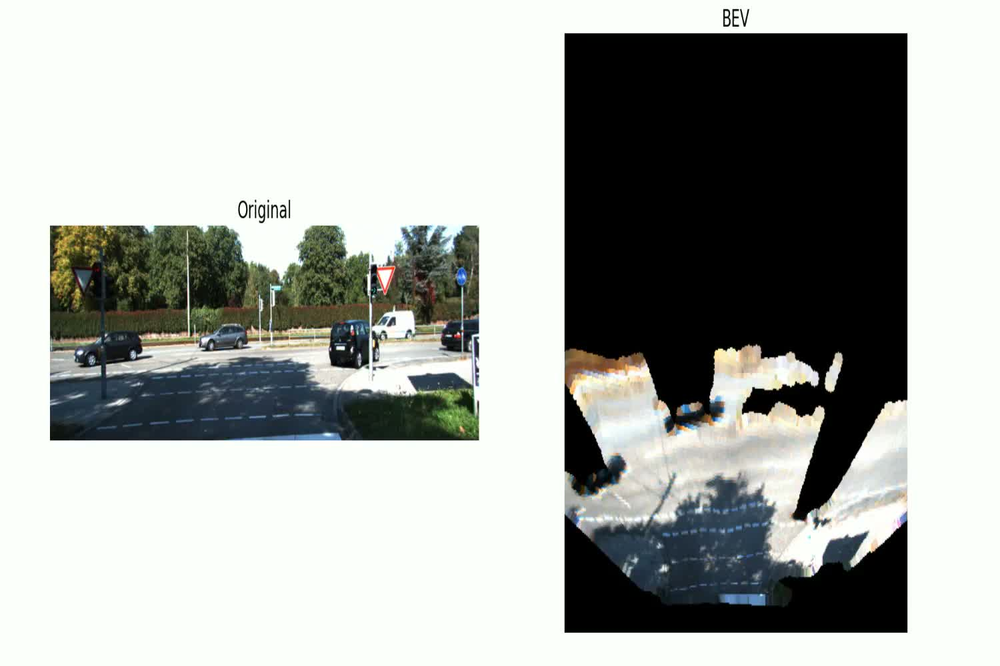

# KITTI Depth Comparison

Outputs a mp4 video visualizing [KITTI](https://www.cvlibs.net/datasets/kitti/raw_data.php) dataset tracklets while comparing depth estimation methods. By "depth" I mean closest point to LiDAR in the forward direction inside bounding boxes. Depth from point clouds is always included with the comparison being from semi-global block matching in stereo vision or deep learning such as [DepthAnything](https://github.com/DepthAnything/Depth-Anything-V2/tree/main)

[Example video](videos/2011_09_26_drive_0005_stereo_dist.mp4)



## Features

* Download and process KITTI raw data sequences automatically

* Compare LiDAR depth measurements with:

  * Stereo matching (SGBM)

  * DepthAnything V2, UniDepth V2, Metric3D V2 (monocular depth estimation)

* Visualize 3D bounding boxes with depth annotations

* Generate comparison videos with top-to-bottom visualization

## Prerequisites

* Python 3.10+

* [uv](https://github.com/astral-sh/uv), git

* GPU ideally or mps (for neural network inference)

* \~2GB disk space per sequence (and deep learning models)

## Installation

1. Clone this repository:

```bash
git clone https://github.com/mpbuyer/kitti-depth-comparison
cd kitti-depth-comparison
```

2. Create a virtual environment and install dependencies with [uv](https://github.com/astral-sh/uv):

```bash
uv venv
source .venv/bin/activate
uv pip install -r requirements.txt
```

## Usage

Basic usage:

```bash
python main.py --sequence 2011_09_26_drive_0048 --method stereo
```

Or a monocular method like DepthAnything:

```bash
python main.py --sequence 2011_09_26_drive_0048 --method depthanything
```

**I was NOT able to test Metric3D on my mps device.** Try with GPU at your own risk.

Downloading KITTI zip files and deep learning model weights probably take the majority of the running time.

### Arguments

* `--sequence`: KITTI sequence to download and process (e.g., `2011_09_26_drive_0048`)

* `--method`: Depth comparison method - `stereo` or `depthanything` or `unidepth`

#### Optional

* `--config`: Path to config file (default: `config.yaml`)

* `--fps`: Video fps (default: 10)

* `--use_distance:` Put True if xy-plane distance (radius) is desired instead of depth

### Configuration

`config.yaml` has:

* Stereo matching parameters (SGBM settings)

* Deep learning model settings

* Video output settings

* Visualization parameters


## Output

The script generates:

* `output/{sequence}_{method}_{dist or depth}.mp4`

* Downloaded KITTI data in the working directory

* DepthAnything repository if selected

## KITTI Sequences

Some example sequences to try:

* `2011_09_26_drive_0001`

* `2011_09_26_drive_0005`

* `2011_09_26_drive_0015`

* `2011_09_26_drive_0048`

* `2011_09_26_drive_0091`

Note: Not all sequences have tracklets and point clouds.

## Not Tested

* Every method on GPU

# Bonus Bird-Eye-View
Bird-Eye-View (BEV) based on the depth map from the method used on the left colored front camera. A bumpy ride with occlusions!

[Example BEV video](videos/2011_09_26_drive_0014_unidepth_BEV.mp4)



example:

```bash
python main_bev.py --sequence 2011_09_26_drive_0048 --method unidepth --fps 10 --segmented True
```
* `--segmented`: remove all but roads and sidewalks
